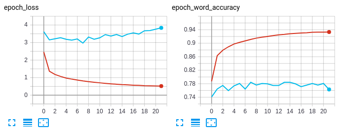

# Convolutional Recurrent Neural Network for End-to-End Text Recognize - TensorFlow 2

This is a re-implementation of [CRNN](http://arxiv.org/abs/1507.05717) network, build by tensorflow 2. This repository may help you to understand how to build an end-to-end text recognition network in a simple way. By the way, Here is the official [repo](https://github.com/bgshih/crnn) implemented by bgshih.

## Abstract

[文本识别网络CRNN——Tensorflow2实现简述](https://zhuanlan.zhihu.com/p/122512498)

This repo aims to build a simple, efficient, end-to-end text recognize network by using the various components of tensorflow 2.

### Requirements

tensorflow >= 2.2

If you use Tensorflow 2.0, 2.1, you can check the custom_training_loop branch.

## Demo

Here I provide a example model that trained on Mjsynth dataset, this model can only predict 0-9 and a-z(ignore case).

- [百度, 提取码: g7dj](https://pan.baidu.com/s/1Gx29JwtQ4HX_53gUajHOAg)
- [google](https://drive.google.com/open?id=1gTJ6Fgo7sfCJdA5ZUBkB76GtcC6Owqly)

### Command
```bash
python demo.py -i example/images/ -t example/table.txt -m MODEL
```

Then, You will see output like this:
```
Path: example/images/1_Paintbrushes_55044.jpg, greedy: paintbrushes, beam search: paintbrushes
Path: example/images/3_Creationisms_17934.jpg, greedy: creationisms, beam search: creationisms
Path: example/images/2_Reimbursing_64165.jpg, greedy: reimbursing, beam search: reimbursing
```

## Train

Before you start training, maybe you should [prepare](#Data-prepare) data first.
The training process can visualize in tensorboard. Because of that, we can check a lot of things, such as profile.



When image through the data input pipeline, the image shape will be resized to (32, width). The height is 32 beacause of CNN construction, the width will determine how many characters the model outputs at most.

### Command

```
python train.py -ta TRAIN_ANNOTATION_PATHS -va VAL_ANNOTATION_PATHS -t TABLE_PATH
```

For more parameters, please refer to the help.

## Data prepare

In order to train this network, you should prepare a lookup table, images and its corresponding labels. Example data is copy from [MJSynth](https://www.robots.ox.ac.uk/~vgg/data/text/) dataset.

### [Lookup table](./example/table.txt)

The file contains all characters and blank label (in the last or any place both ok, but I find tensorflow decoders can't change it now, so set it to last). By the way, you can write any word as blank.

### Image data

It's an End-to-End method, so we don't need to indicate the position of character in the image.


The labels corresponding to these three pictures are `Paintbrushes`, `Creationisms`, `Reimbursing`.

### [Label data](./example/annotation.txt)

We should write the image path and its corresponding label to a text file in a certain format such as example data. The data input pipeline will automatically detect the known format. Customization is also very simple, please check out the [dataset.py](dataset.py)

#### Support format

- MJSynth
- ICDAR2013
- [relative path] [label] such as [example.jpg awesome]

## Eval

```
usage: eval.py [-h] -a ANNOTATION_PATHS [ANNOTATION_PATHS ...] -t TABLE_PATH
               [-w IMAGE_WIDTH] [-b BATCH_SIZE] -m MODEL [--channels CHANNELS]
```

## Ecosystem

There are many components here to help us do other things. For example, deploy by `Tensorflow serving`. Before you deploy, you can pick up a good weight, and converte model to SavedModel format by this command:
```
usage: converter.py [-h] -m MODEL -o OUTPUT [--save_format SAVE_FORMAT]
```
And now `Tensorflow lite` also can convert this model, that means you can deploy it to Android, iOS etc.