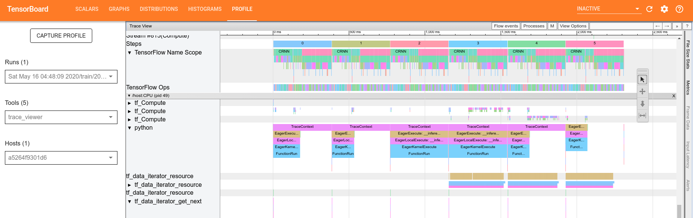

# Convolutional Recurrent Neural Network for End-to-End Text Recognize - TensorFlow 2


[](https://arxiv.org/abs/1507.05717)
[](https://zhuanlan.zhihu.com/p/122512498)

This is a re-implementation of the CRNN network, build by TensorFlow 2. This repository may help you to understand how to build an End-to-End text recognition network easily. By the way, here is the official [repo](https://github.com/bgshih/crnn) implemented by bgshih.

## Abstract

This repo aims to build a simple, efficient text recognize network by using the various components of TensorFlow 2. The model build by the Keras API, the data pipeline build by `tf.data`, and training with `model.fit`, so we can use most of the functions provided by Tensorflow 2, such as `Tensorboard`, `Distribution strategy`, `TensorFlow Profiler` etc.

## Demo

Here I provide an example model that trained on the Mjsynth dataset, this model can only predict 0-9 and a-z(ignore case).

- [百度, 提取码: g7dj](https://pan.baidu.com/s/1Gx29JwtQ4HX_53gUajHOAg)
- [Google](https://drive.google.com/open?id=1gTJ6Fgo7sfCJdA5ZUBkB76GtcC6Owqly)

### Command
```bash
$ python crnn/demo.py -i example/images/ -t example/table.txt -m path/to/model
```

Then, You will see output like this:
```
Path: example/images/1_Paintbrushes_55044.jpg, greedy: paintbrushes, beam search: paintbrushes
Path: example/images/3_Creationisms_17934.jpg, greedy: creationisms, beam search: creationisms
Path: example/images/2_Reimbursing_64165.jpg, greedy: reimbursing, beam search: reimbursing
```

Sometimes the beam search method will be better than the greedy method, but it's costly.

## Train

Before you start training, maybe you should [prepare](#Data-prepare) data first.
The training process can visualize in Tensorboard. Because of that, we can check a lot of things, such as profiler.



When image through the data input pipeline, the image shape will be resized to (32, width). The height is 32 because of CNN construction, the width will determine how many characters the model outputs at most.

All predictable characters are defined by the [table.txt](./example/table.txt) file, make sure the file is the same as the file used during training.

### Command

```
$ python crnn/train.py -ta TRAIN_ANNOTATION_PATHS -va VAL_ANNOTATION_PATHS -t TABLE_PATH
```

Before starting training, we can use `restore` parameter to restore the model to convergence fastly, even if the number of characters is different.

For more parameters, please refer to the help.

### Distributed training

Now, this repo support distributed training, just follow the official [guide](https://www.tensorflow.org/guide/distributed_training#using_tfdistributestrategy_with_tfkerasmodelfit).

1. Create an instance of the appropriate tf.distribute.Strategy.
2. Move the creation of Keras model, optimizer and metrics inside strategy.scope.

Don't forget add `drop_remainder=True` to `tf.data.batch()`

## Data prepare

To train this network, you should prepare a lookup table, images and corresponding labels. Example data is copy from [MJSynth](https://www.robots.ox.ac.uk/~vgg/data/text/) and ICDAR2013 dataset.

### [Lookup table](./example/table.txt)

The file contains all characters and blank labels (in the last or any place both ok, but I find Tensorflow decoders can't change it now, so set it to last). By the way, you can write any word as blank.

### Image data

It's an End-to-End method, so we don't need to indicate the position of the character in the image.


The labels corresponding to these three pictures are `Paintbrushes`, `Creationisms`, `Reimbursing`.

### Annotation file

We should write the image path and its corresponding label to a text file in a certain format such as example data. The data input pipeline will automatically detect the known format. Customization is also very simple, please check out the [dataset factory](./crnn/dataset_factory.py)

#### Support format

- [MJSynth](./example/mjsynth_annotation.txt)
- [ICDAR2013](./example/icdar2013_annotation.txt)
- [Simple](./example/simple_annotation) such as [example.jpg awesome]

## Eval

```
$ python crnn/eval.py [-h] -a ANNOTATION_PATHS [ANNOTATION_PATHS ...] -t TABLE_PATH
               [-w IMAGE_WIDTH] [-b BATCH_SIZE] -m MODEL [--channels CHANNELS]
```

## Converte & Ecosystem

There are many components here to help us do other things. For example, deploy by `Tensorflow serving`. Before you deploy, you can pick up a good weight, and convertes model to `SavedModel`/`h5` format by this command, it will add the Softmax layer in the last and cull the optimizer:
```
$ python tools/converter.py [-h] -m MODEL -o OUTPUT
```
And now `Tensorflow lite` also can convert this model, that means you can deploy it to Android, iOS etc.